# ISI Tempered Windows

Makes windows 100x stronger. Still weaker than normal blocks (they are windows after all), but now they won't shatter when a zombie sneezes.

## Numbers

|                    | frameshape | wood      | cobblestone | concrete | steel |
|--------------------|:----------:|:---------:|:-----------:|:--------:|:-----:|
| **windows before** | 1 (*0.1*)  | 1 (*0.5*) | 2 (*1.5*)   | 5        | 10    |
| **windows after**  | 10         | 50        | 150         | 500      | 1000  |
| **normal blocks**  | 100        | 500       | 1500        | 5000     | 10000 |

*Values in parentheses are the raw numbers. In game they are rounded up to the nearest whole number.*

## Before

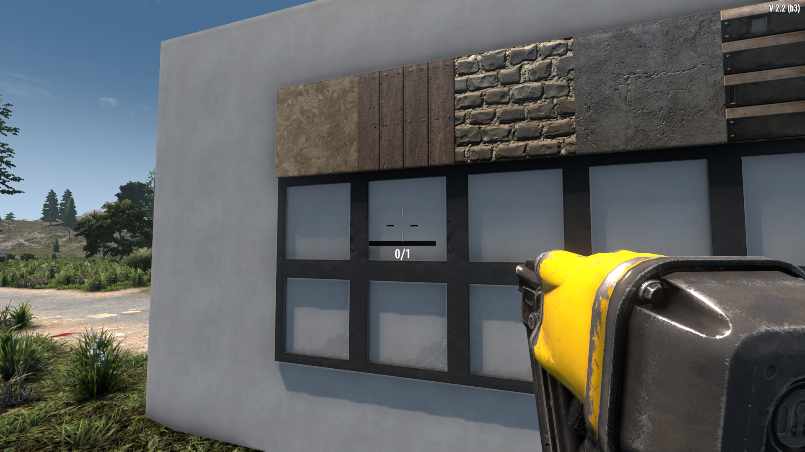
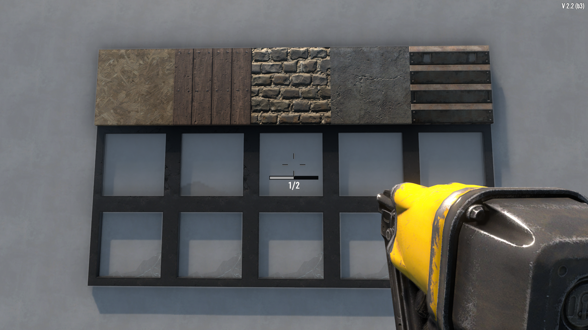
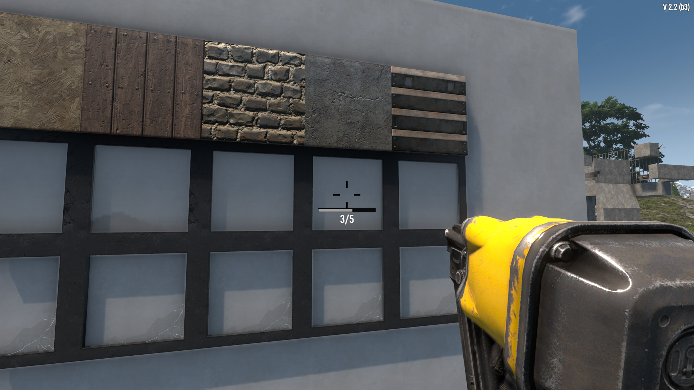
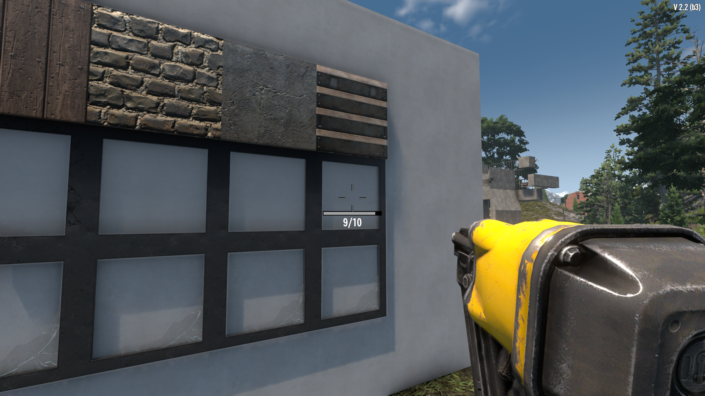

## After

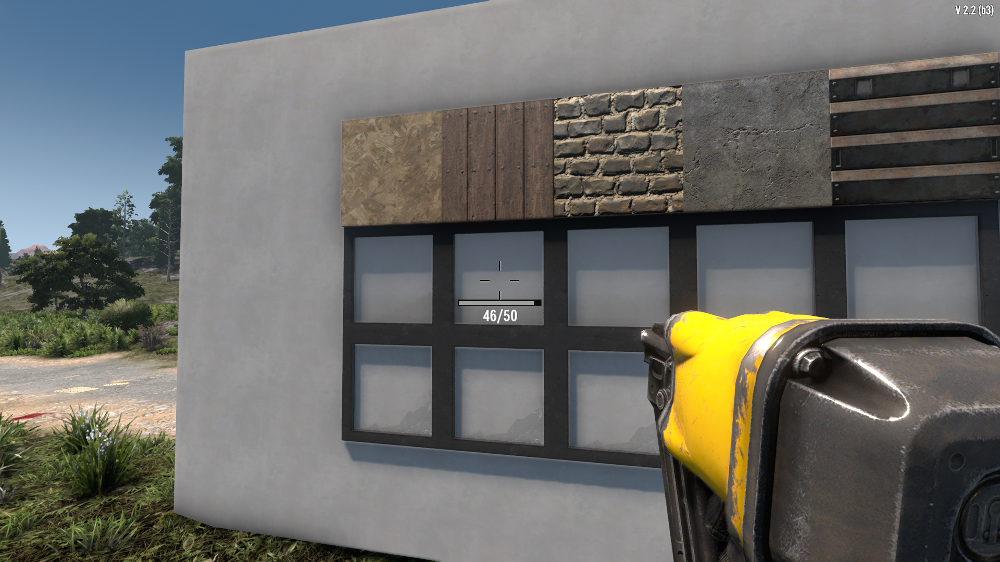
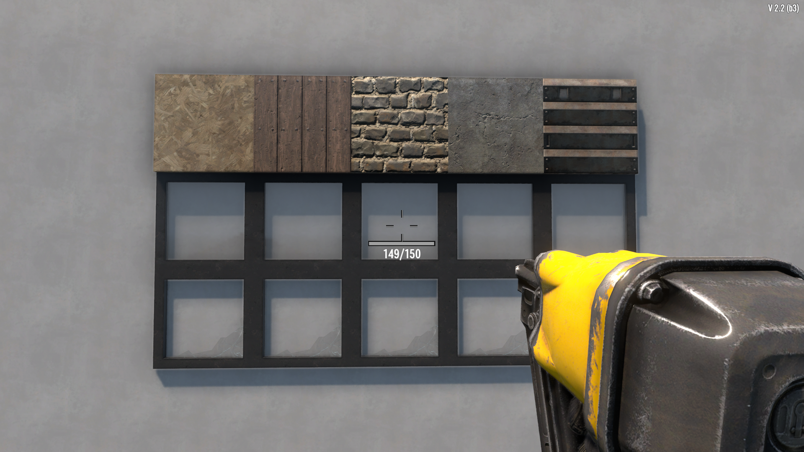
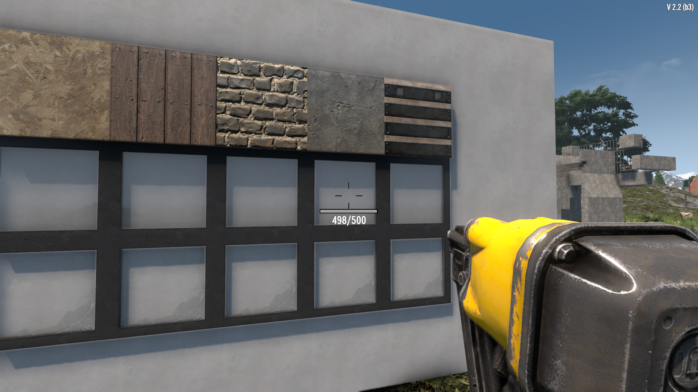
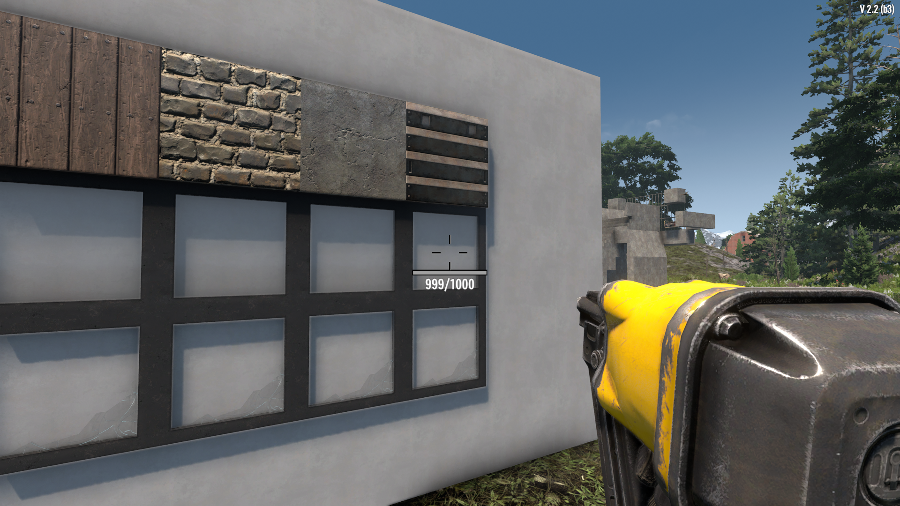

## Normal

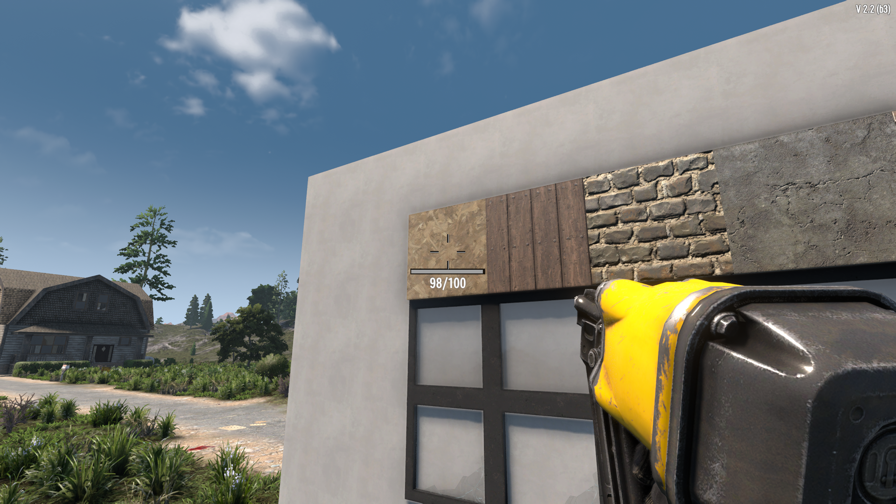
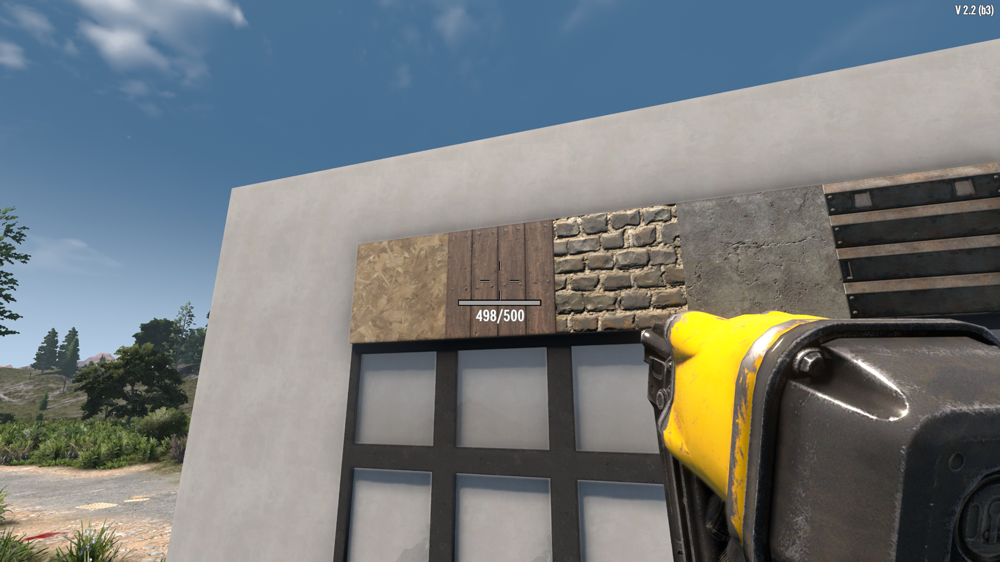
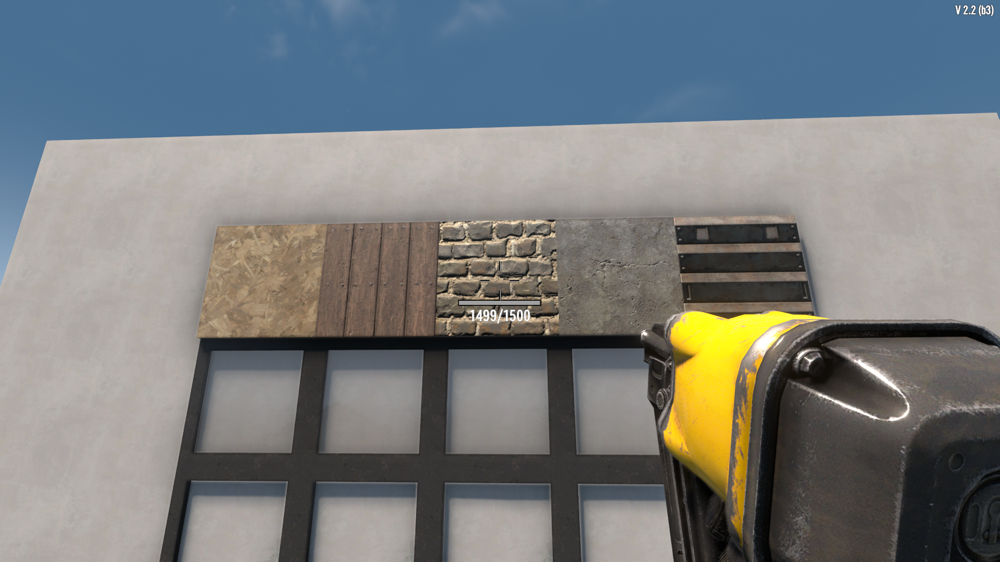
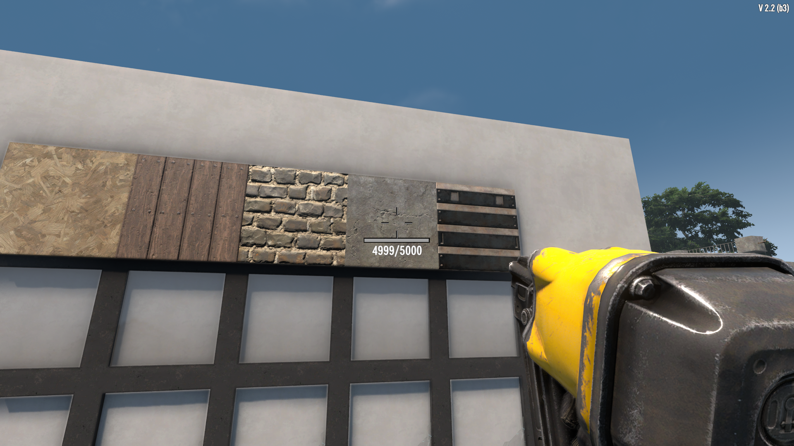
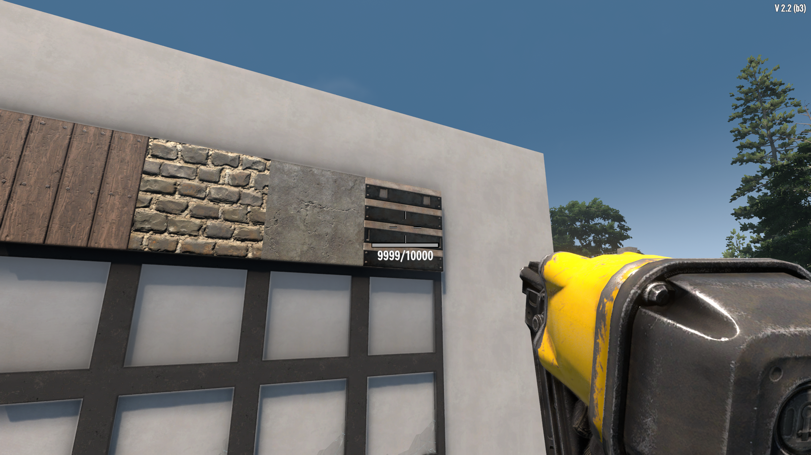
